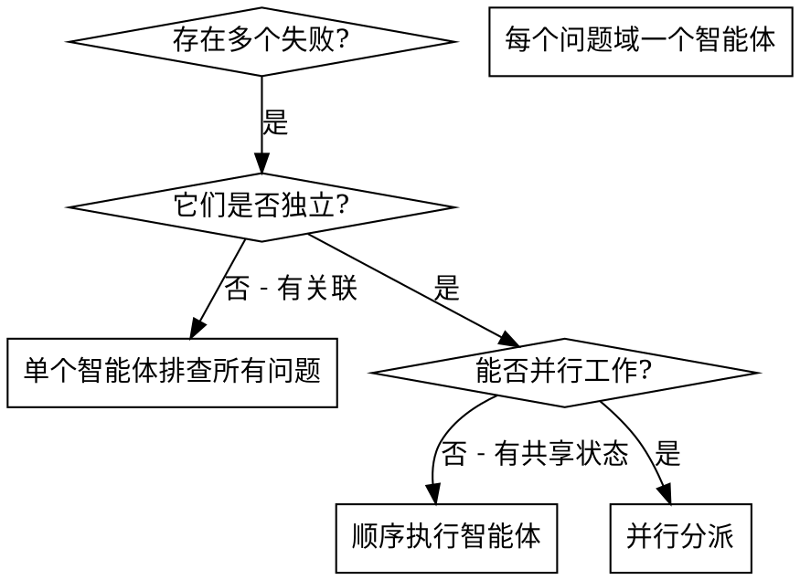

# 并行分派智能体

## 概述

将任务委派给上下文隔离的专用智能体。它们不继承你的会话上下文或历史记录——精确构造它们所需的一切，同时为你保留协调工作的上下文。

遇到多个互不相关的失败（不同测试文件、不同子系统、不同 bug）时，逐项排查浪费时间。每个排查独立，可并行。

**核心原则：** 每个独立问题域分派一个智能体，并发工作。

## 何时使用



**适用：**
- 3 个以上测试文件因不同根因失败
- 多个子系统独立故障
- 问题无需其他问题上下文即可理解
- 排查之间无共享状态

**不适用：**
- 失败相关（修复一个可能修复其他）
- 需理解完整系统状态
- 智能体互相干扰

## 模式

### 1. 识别独立的问题域

按故障分组（文件 A 测试：工具审批流程；文件 B 测试：批量完成行为；文件 C 测试：中止功能）。每个问题域独立——修复工具审批不影响中止测试。

### 2. 创建聚焦的智能体任务

每个智能体获得：
- **明确范围：** 一个测试文件或子系统
- **清晰目标：** 让这些测试通过
- **约束条件：** 不修改其他代码
- **预期输出：** 发现和修复内容的总结

### 3. 并行分派

```typescript
Task("修复 agent-tool-abort.test.ts 的失败")
Task("修复 batch-completion-behavior.test.ts 的失败")
Task("修复 tool-approval-race-conditions.test.ts 的失败")
// 三个任务并发运行
```

### 4. 审查与集成

智能体返回后：
- 阅读每个总结
- 验证修复之间没有冲突
- 运行完整测试套件
- 集成所有更改

## 智能体提示词结构

提示词必须：
1. **聚焦** - 一个清晰的问题域
2. **自包含** - 含理解问题所需的所有上下文
3. **明确输出要求** - 智能体应返回什么？

```markdown
修复 src/agents/agent-tool-abort.test.ts 中 3 个失败的测试：

1. "should abort tool with partial output capture" - 期望消息含 'interrupted at'
2. "should handle mixed completed and aborted tools" - 快速工具被中止而非完成
3. "should properly track pendingToolCount" - 期望 3 个结果但得到 0 个

这些是时序/竞态条件问题。你的任务：

1. 阅读测试文件，理解每个测试验证的内容
2. 找到根因——是时序问题还是实际 bug？
3. 修复方式：
   - 用基于事件的等待替换任意超时
   - 若发现中止实现中的 bug 则修复
   - 若测试的是已变更的行为则调整测试期望

不要只是增加超时时间——找到真正的问题。

返回：你发现了什么以及修复了什么的总结。
```

## 常见错误

- **太宽泛：** "修复所有测试" → 智能体迷失方向；应具体到文件："修复 agent-tool-abort.test.ts"
- **无上下文：** "修复竞态条件" → 智能体不知道在哪里；应粘贴错误信息和测试名称
- **无约束：** 智能体可能重构所有代码；应设置约束："不要修改生产代码"
- **模糊输出：** "修好它" → 你不知道改了什么；应要求"返回根因和修改内容的总结"

## 不适用的场景

- **关联性失败：** 修复一个可能修复其他——先一起排查
- **需要完整上下文：** 理解问题需看到整个系统
- **探索性调试：** 你还不知道什么坏了
- **共享状态：** 智能体互相干扰（编辑同一文件、使用同一资源）

## 实际案例

大规模重构后 3 个文件中 6 个测试失败：
- agent-tool-abort.test.ts：3 个失败（时序问题）
- batch-completion-behavior.test.ts：2 个失败（工具未执行）
- tool-approval-race-conditions.test.ts：1 个失败（执行计数 = 0）

问题域独立（中止逻辑、批量完成、竞态条件），分派三个智能体，各自修复一个文件。结果：替换超时为事件等待、修复事件结构 bug（threadId 位置不对）、添加等待异步工具执行完成的逻辑。所有修复无冲突，完整测试套件通过。

## 验证

智能体返回后：
1. **审查每个总结** - 理解改了什么
2. **检查冲突** - 智能体是否编辑了同一段代码？
3. **运行完整套件** - 验证所有修复协同工作
4. **抽查** - 智能体可能犯系统性错误
